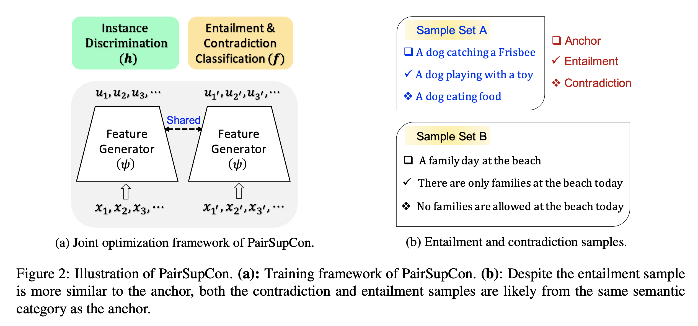

## PairSupCon: Pairwise Supervised Contrastive Learning of Sentence Representations  

This repository contains the code for our paper [Pairwise Supervised Contrastive Learning of Sentence Representations (EMNLP 2021)](https://aclanthology.org/2021.emnlp-main.467/). Dejiao Zhang, Shang-Wen Li, Wei Xiao, Henghui Zhu, Ramesh Nallapati, Andrew Arnold, and Bing Xiang.


## Overview



## Train PairSupCon on NLI or your own datasets 

### Dependencies:
    python==3.7.10 
    transformers==4.8.1
    sentence-transformers==2.0.0
    numpy==1.19.2
    sklearn==0.23.2
    tensorboardX==2.3
    pandas 
   

### To run the code:
    bash ./scripts/run_pairsupcon.sh


### NLI Dataset

We train our model over the combination of SNLI and MNLI datasets. As we stated in our paper, we drop the neural pairs as its functionality is already covered by the instance-discrimination loss. You can also download the data from the [SimCSE](https://github.com/princeton-nlp/SimCSE/blob/main/data/download_nli.sh) and run the following code:

```python
import pandas as pd

df = pd.read_csv("./nli_for_simcse.csv")
sent0 = df.sent0.values
sent1 = np.concatenate((sent0, sent0), axis=0)
sent2 = np.concatenate((df.sent1.values, df.hard_neg.values), axis=0)

dfnew = pd.DataFrame({'sentence1':sent1, 'sentence2':sent2, 'pairsimi': np.array([1]*len(sent0) + [0]*len(sent0))})
dfnew = dfnew.sample(frac=1, replace=False)
dfnew.to_csv("path-to-the-nli-dataset/nli_train_posneg.csv", index=False)

```


## Import PairSupCon from Huggingface Model Hub
```python
from transformers import AutoModel, AutoTokenizer

# Import PairSupCon models
tokenizer = AutoTokenizer.from_pretrained("aws-ai/pairsupcon-bert-base-uncased")
model = AutoModel.from_pretrained("aws-ai/pairsupcon-bert-base-uncased")

tokenizer = AutoTokenizer.from_pretrained("aws-ai/pairsupcon-bert-large-uncased")
model = AutoModel.from_pretrained("aws-ai/pairsupcon-bert-large-uncased")

```


## Downstream Evaluation

We provide the evaluation code for both STS and Clustering evaluation. Please navigate to the "../DownstreamEval" folder and checkout the details there. 

    


## Citation:
```bibtex 
@inproceedings{zhang-etal-2021-pairwise,
title = "Pairwise Supervised Contrastive Learning of Sentence Representations",
author = "Zhang, Dejiao  and
  Li, Shang-Wen  and
  Xiao, Wei  and
  Zhu, Henghui  and
  Nallapati, Ramesh  and
  Arnold, Andrew O.  and
  Xiang, Bing",
booktitle = "Proceedings of the 2021 Conference on Empirical Methods in Natural Language Processing",
month = nov,
year = "2021",
address = "Online and Punta Cana, Dominican Republic",
publisher = "Association for Computational Linguistics",
url = "https://aclanthology.org/2021.emnlp-main.467",
pages = "5786--5798",
abstract = "Many recent successes in sentence representation learning have been achieved by simply fine-tuning on the Natural Language Inference (NLI) datasets with triplet loss or siamese loss. Nevertheless, they share a common weakness: sentences in a contradiction pair are not necessarily from different semantic categories. Therefore, optimizing the semantic entailment and contradiction reasoning objective alone is inadequate to capture the high-level semantic structure. The drawback is compounded by the fact that the vanilla siamese or triplet losses only learn from individual sentence pairs or triplets, which often suffer from bad local optima. In this paper, we propose PairSupCon, an instance discrimination based approach aiming to bridge semantic entailment and contradiction understanding with high-level categorical concept encoding. We evaluate PairSupCon on various downstream tasks that involve understanding sentence semantics at different granularities. We outperform the previous state-of-the-art method with 10{\%}{--}13{\%} averaged improvement on eight clustering tasks, and 5{\%}{--}6{\%} averaged improvement on seven semantic textual similarity (STS) tasks."}
```
    

Contact person: [Dejiao Zhang](https://www.amazon.science/author/deijao-zhang), [dejiaoz@amazon.com](dejiaoz@amazon.com)


## License

This project is licensed under the Apache-2.0 License.
    


